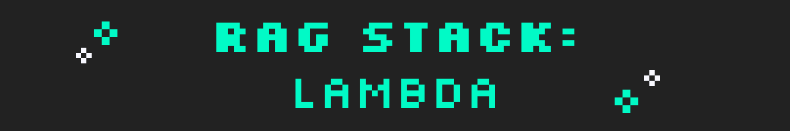
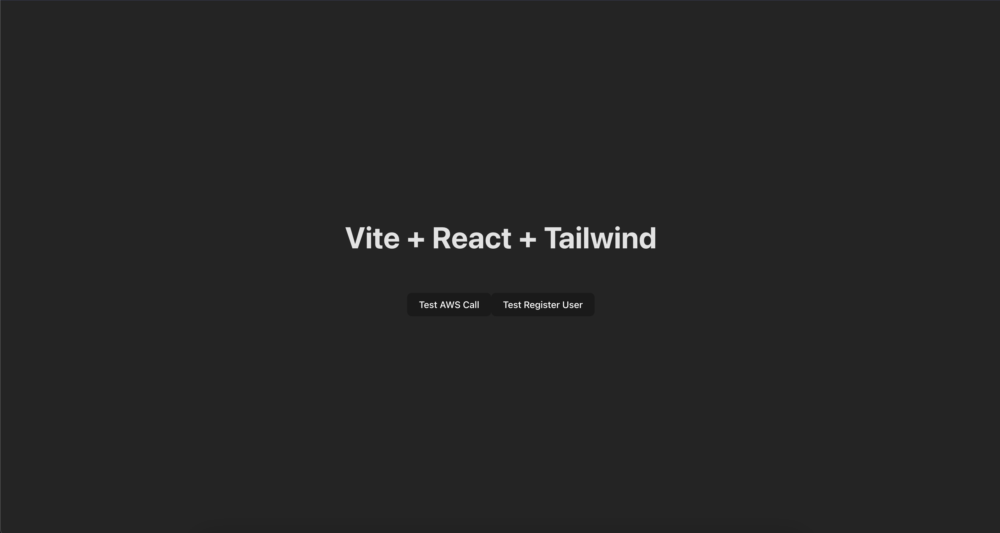
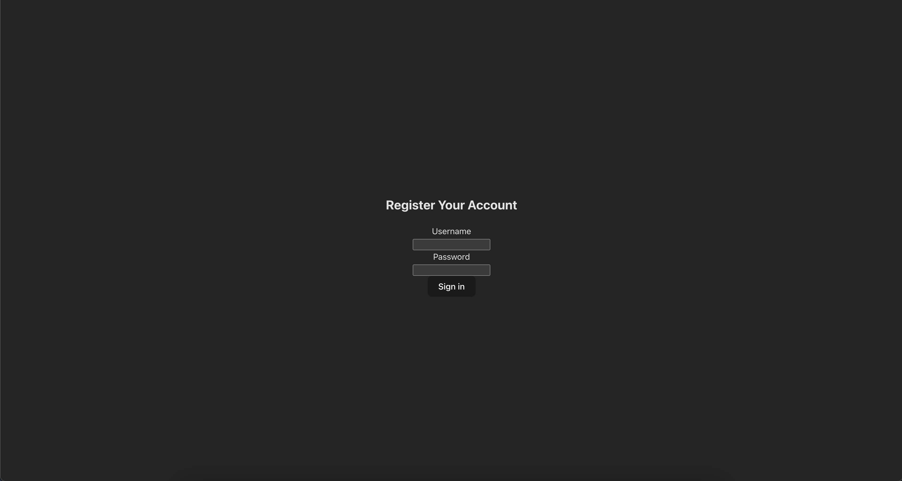

# ☆ Welcome to the Rag Stack Serverless Service! ☆

This is an example of an end-to-end stack that uses React, AWS and Go for a **fully scalable** and **hosted application**.

This stack comes with middleware, protected routes, and a log in/register user feature that backs up to a Dynamo Database.

This stack consists of:

- Vite, React, Tailwind on the Frontend
- Go, AWS SDK on the Backend
- DynamoDB, Lambda, API Gateway and CloudFront on the infrastructure


Lambda is the deployment of choice. If you want to deploy your code to a Fargate service, check out [this repo here.](https://github.com/Melkeydev/rag-stack-fargate)

## Hosted Site Preview ☞


<br>



## Prerequisites ✎

- [AWS CDK](https://docs.aws.amazon.com/cdk/v2/guide/getting_started.html#getting_started_install) and [Typescript](https://www.typescriptlang.org/download) should be installed on your system.

- AWS credentials should be configured on your system.

- A domain name registered with [Route53](https://aws.amazon.com/route53/) with a hosted zone.

## Deployment ⏎

Build the main binary file with: `go build -o main`
in the `lambda/cmd` route.

In your terminal, be sure to log in to your AWS SSO using `aws sso login` and specify a profile with `--profile` if needed.

From there, you will be able to use `cdk deploy`. If using a profile, specify with `--profile`.

Upon first deployment, you will receive a prompt to allow Rag Stack to make changes. You must approve these to continue.

After deployment, Rag Stack will send back some outputs:

- Your API endpoint
- Your DistributionURL
- A Stack ARN

After that, feel free to customize the stack to your liking! It's fully capable to be built upon and expanded, as well as fully customized.

When you're ready to host the stack online, set your Route53 domain to route traffic to your provided DistributionURL. Find more info on how to do that [here](https://docs.aws.amazon.com/Route53/latest/DeveloperGuide/routing-to-cloudfront-distribution.html). Keep in mind that you will also have to set your domain as an alternate domain on the CloudFront dashboard using an Amazon-Issued SSL certificate that was requested in the US-East-1 zone.

## Useful Commands ☺︎

- To compile Typescript to JS:
    ```
    npm run build
    ```
- To watch for changes and compile:
    ```
    npm run watch
    ```
- To perform the jest unit tests:
    ```
    npm run test
    ```
- To deploy this stack to your default AWS account/region:
    ```
    cdk deploy
    ```
- To compare deployed stack with current state:
    ```
    cdk diff
    ```
- This emits the synthesized CloudFormation template:
    ```
    cdk synth
    ```

## Clean Up ☠︎

- Run the following command to delete the stack:
    ```
    cdk destroy
    ```

## Troubleshooting ⚙

Having issues? We've all been there. Check here to see if there's a solution!

<details><summary><b>Couldn't create stack! Returned ROLLBACK-IN-PROGRESS/DELETE-IN-PROGRESS</b></summary>

<br>

If this is your first time using AWS's API Gateway, you need to create/set a role that's allowed to write CloudWatch logs!

For this, go into your IAM dashboard and create a role (name it whatever you'd like) and attach the policy `AmazonAPIGatewayPushToCloudWatchLogs`.

After creation, it will provide you with an ARN. Take that, head into your API Gateway settings, and enter that ARN into the Logging box.

Save your changes, go into your CloudFormation dashboard, and delete the existing Rag Stack attempt. Head back into your terminal and deploy again! :)
</details>

<br>

</br>

<details><summary><b>Deployed stack to hosted domain, but only see grey! Console says "Uncaught ReferenceError: Require is not defined."</b></summary>

<br>

For this, if the console points to an `index.js` file with a snippet that has something along the lines of: `const z= require(react/jsx-runtime)`, this means that the code bundled incorrectly!

The browser is pulling from the codebase's `HomePage.js` and `Register.js` files, which use a Node `require()` function that browsers don't support. The browser **should** be pulling from the `HomePage.tsx` and `Register.tsx` files.

To remedy this, go into `./frontend/src/App.tsx` and alter lines `4` and `5` to read `.tsx` after both Register and HomePage.

Be sure to save these changes, and then redeploy! :)
</details>

<br>

## Questions, Comments, Suggestions? ✍︎

Join the [Discord server](discord.gg/melkeydevhouse)! We're always around to help.

You can also probably catch Melkey working live on [Twitch](twitch.tv/melkey)! 

Pop in and say hi! ♡

## License

MIT License

Copyright (c) [2023] [Melkeydev](https://github.com/Melkeydev)

Permission is hereby granted, free of charge, to any person obtaining a copy
of this software and associated documentation files (the "Software"), to deal
in the Software without restriction, including without limitation the rights
to use, copy, modify, merge, publish, distribute, sublicense, and/or sell
copies of the Software, and to permit persons to whom the Software is
furnished to do so, subject to the following conditions:

The above copyright notice and this permission notice shall be included in all
copies or substantial portions of the Software.

THE SOFTWARE IS PROVIDED "AS IS," WITHOUT WARRANTY OF ANY KIND, EXPRESS OR
IMPLIED, INCLUDING BUT NOT LIMITED TO THE WARRANTIES OF MERCHANTABILITY, FITNESS
FOR A PARTICULAR PURPOSE, AND NONINFRINGEMENT. IN NO EVENT SHALL THE AUTHORS OR
COPYRIGHT HOLDERS BE LIABLE FOR ANY CLAIM, DAMAGES, OR OTHER LIABILITY, WHETHER
IN AN ACTION OF CONTRACT, TORT, OR OTHERWISE, ARISING FROM, OUT OF, OR IN
CONNECTION WITH THE SOFTWARE OR THE USE OR OTHER DEALINGS IN THE SOFTWARE.